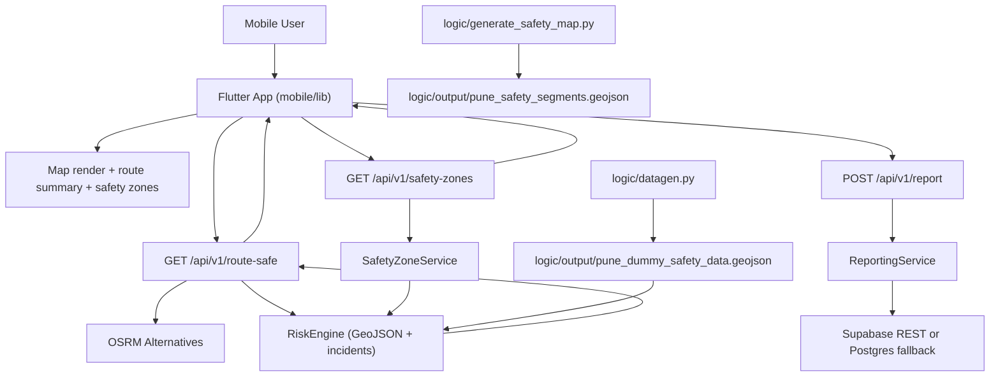

# PROGRESS.md

## Project Overview
WalkSafe is a safety-first pedestrian navigation system focused on Pune, India.

The project goal is to help walkers choose safer routes rather than simply shortest or fastest routes. The system combines static road safety features, incident reports, and routing alternatives to compute and present lower-risk paths.

The problem it addresses is that mainstream navigation tools optimize for travel efficiency and generally do not prioritize personal safety context (incident density, low-light areas, late-hour exposure, etc.).

Intended users include:
- Pedestrians who want safer walking guidance.
- People walking during off-hours who need risk-aware routing.
- Communities that want to contribute local incident signals.

Core idea:
- Get candidate walking routes.
- Score route segments with a risk function.
- Select the route with lowest aggregate risk.
- Show safety overlays and allow incident reporting.

## Architecture Overview
### System Components
1. Mobile app (`mobile/`, Flutter)
- Renders map, route, overlays, reporting UI, SOS flows.
- Calls backend APIs for route and report operations.
- Caches reports and safety zones for degraded/offline behavior.

2. Backend API (`backend/`, FastAPI)
- Exposes routing, risk scoring, incident report, emergency alert, and safety-zone endpoints.
- Coordinates OSRM route alternatives and dynamic risk scoring.
- Uses Supabase REST and/or Postgres connection fallback.

3. Spatial data pipeline (`logic/`, Python geospatial stack)
- Builds walkable street graph from OSM.
- Generates segment-level safety dataset.
- Produces dummy zonal safety dataset with time penalties.

4. Data stores and external systems
- Supabase/Postgres for incident and emergency persistence.
- OSRM public routing API for route alternatives.
- OSM/Overpass/OSMnx for map graph and source data.

### High-Level Data Flow


### Key Design Decisions Observed
1. Backend runs in degraded mode if DB is unavailable.
- `backend/app/main.py` catches DB connect failures at startup.
- This keeps route scoring available from local datasets even when persistence is down.

2. Risk scoring is dataset-driven first, incidents second.
- RiskEngine always uses `logic/output/pune_dummy_safety_data.geojson`.
- Live incidents are additive penalties if incident retrieval is available.

3. Mobile follows backend-first, fallback-second routing.
- `mobile/lib/services/routing_service.dart` first calls `/route-safe`.
- Falls back to OSRM + `/route/risk`, then to local heuristic scoring.

4. Safety zones are API-backed but locally cached.
- `mobile/lib/services/safety_heatmap_service.dart` requests `/safety-zones`, stores zone cache in SharedPreferences.
- Falls back to mock zones if neither network nor cache is available.

5. Compatibility endpoints retained.
- Reports router supports both `/reports` and `/report`.
- Emergency supports both `/reports/emergency` and `/report/emergency`.

## Implemented Features
| Feature Name | Description | Location | How It Works |
|---|---|---|---|
| API Boot and Offline Startup | FastAPI starts even if DB connection fails | `backend/app/main.py` | Lifespan tries DB connect, logs error, continues serving |
| Route Mock Endpoint | Returns mock safest/fastest paths | `backend/app/routers/routing.py` (`GET /route`) | Synthetic mid-point path; no graph routing yet |
| Route Risk Scoring Endpoint | Scores provided route coordinates | `backend/app/routers/routing.py` (`POST /route/risk`) | Converts coordinates, calls `RiskEngine.score_route` |
| Consolidated Safest Route Endpoint | Backend-orchestrated safest route selection | `backend/app/routers/routing.py` (`GET /route-safe`) | Fetches OSRM alternatives, scores each, returns lowest-risk route |
| Safety Zones Endpoint | Returns classified zones + GeoJSON | `backend/app/routers/routing.py` (`GET /safety-zones`) | Calls `SafetyZoneService`, supports version short-circuit + bbox |
| OSRM Integration Service | Fetches walking alternatives | `backend/app/services/osrm_service.py` | Uses OSRM `/route/v1/foot` with `alternatives=true` and geojson geometry |
| Dynamic Risk Engine | Computes segment/route risk with time + incident penalties | `backend/app/services/risk_engine.py` | Nearest segment lookup on dummy dataset + incident recency/severity/confidence penalties |
| Supabase REST Client | Reads/inserts Supabase rows via PostgREST | `backend/app/services/supabase_client.py` | Async HTTP wrapper for `fetch_rows` and `insert_row` |
| Report Persistence Service | Incident report create/recent retrieval | `backend/app/services/reporting_service.py` | Writes to Supabase if configured, otherwise DB fallback |
| Emergency Alert Persistence | Stores SOS alerts | `backend/app/services/reporting_service.py` + router | Inserts emergency alert rows with metadata |
| Canonical Incident/Emergency Schemas | Request/response models with validation | `backend/app/schemas/reports.py` | Pydantic models for report and emergency payloads |
| Canonical SQL Schema | PostGIS + incident/emergency tables | `backend/app/schema.sql` | Creates `incident_reports`, `emergency_alerts`, indexes, plus legacy node/edge tables |
| Schema Initialization Script | Applies SQL statements programmatically | `backend/init_db.py` | Reads `schema.sql`, executes statements sequentially |
| Street Graph Generation | OSMnx graph extraction for Pune | `logic/generate_street_graph.py` | Fetches walk graph around city center radius |
| Segment Safety Dataset Generation | Builds segment-level safety GeoJSON | `logic/generate_safety_map.py` | Scores each segment using feature engine and writes GeoJSON |
| Safety Feature Engine | Segment score from incidents/road/crowd/time factors | `logic/safety_feature_engine.py` | STRtree incident proximity + heuristics -> final safety score |
| Dummy Zonal Data Generation | Adds pseudorandom risk zones + time penalties | `logic/datagen.py` | Assigns base safety tiers and generated attributes to segments |
| Logic Safety API | Safety map and nearest-segment score service | `logic/api.py` | In-memory STRtree index over `pune_safety_segments.geojson` |
| Mobile App Bootstrap | Supabase optional init and app startup | `mobile/lib/main.dart` | Reads `SUPABASE_URL` + `SUPABASE_ANON_KEY` from dart-define |
| Map Home Experience | Route tap, overlays, status cards, SOS button | `mobile/lib/screens/home_screen.dart` | Coordinates services for location, route, logic score, zones |
| Backend-First Mobile Routing | Uses `/route-safe` first with fallback chain | `mobile/lib/services/routing_service.dart` | Route-safe -> route-risk -> local scoring |
| Local Fallback Safety Scoring | Scores route segments without backend | `mobile/lib/services/safety_score_service.dart` | Uses local incident storage and heuristics |
| Safety Zone Cache Service | API fetch + SharedPreferences cache + mock fallback | `mobile/lib/services/safety_heatmap_service.dart` | Maintains cached zones/version and parsed API zones |
| Incident Report Screen | Capture incident pin/type/details and submit | `mobile/lib/screens/report_incident_screen.dart` | Sends backend report and always stores local copy |
| Incident Local Storage | Local report persistence | `mobile/lib/services/incident_storage_service.dart` | Stores serialized report list in SharedPreferences |
| SOS API Submission | Sends emergency alerts to backend | `mobile/lib/services/sos_service.dart` + `reporting_api_service.dart` | Uses `/report/emergency` with generated user hash |
| Logic Safety Probe in Mobile | Nearest segment score display | `mobile/lib/services/logic_safety_api_service.dart` | Calls separate logic API (`LOGIC_API_BASE_URL`) |
| Safety Zone Legend + Toggle UI | Risky/Cautious/Safe overlay controls | `mobile/lib/widgets/safety_legend_card.dart` + home screen | Visual legend + on/off switch for overlays |
| Single Widget Test | Splash text smoke test | `mobile/test/widget_test.dart` | Asserts app launch and splash labels |

## Technical Stack
### Languages
- Python
- Dart
- SQL
- Kotlin/Swift/C++/web scaffolding (Flutter platform layers)

### Frameworks and Libraries
- FastAPI: backend API framework for async route/report services.
- databases + asyncpg: async DB access.
- pydantic + pydantic-settings: schema validation and env config.
- httpx: backend HTTP calls (OSRM, Supabase REST, logic incident ingestion).
- shapely + rtree (optional): geometry operations and nearest lookup.
- geopandas + pyproj + osmnx: spatial data generation and projection.
- networkx: prototype graph routing service.
- Flutter + Material 3: mobile UI and stateful app flows.
- flutter_map + latlong2: map tiles and geometry rendering.
- polyline_codec: OSRM polyline decode for fallback path.
- geolocator: current location acquisition.
- shared_preferences: local cache for reports and safety zones.
- supabase_flutter: optional mobile-side Supabase bootstrap.

### Infrastructure and Services
- Supabase (PostgREST + Postgres): primary intended incident/emergency persistence.
- PostGIS (Docker local): local development DB fallback.
- OSRM public routing endpoint: route alternatives.
- OSM/Overpass via OSMnx: road graph source and local cache artifacts.

### Tooling
- Uvicorn: FastAPI server.
- Flutter toolchain + Gradle/Xcode/CMake generated project files.
- Docker Compose for local PostGIS.

### Why These Choices (Observed)
- FastAPI + async tooling enables IO-heavy API workflows (OSRM + DB + scoring).
- OSMnx/geopandas/shapely provide practical spatial processing for prototype safety datasets.
- Flutter gives cross-platform mobile delivery with fast iteration.
- SharedPreferences is a simple offline cache mechanism for prototype stage.
- Supabase REST supports simple backend integration without writing raw driver-heavy code paths everywhere.

## File and Directory Guide
| Path | Purpose |
|---|---|
| `backend/` | FastAPI app, DB config/schema, runtime services |
| `backend/app/main.py` | API bootstrap, router registration, startup/shutdown lifecycle |
| `backend/app/routers/routing.py` | Route APIs (`/route`, `/route/risk`, `/route-safe`, `/safety-zones`) |
| `backend/app/routers/reports.py` | Report and emergency APIs |
| `backend/app/services/risk_engine.py` | Core safety/risk scoring logic |
| `backend/app/services/reporting_service.py` | Incident/emergency persistence and retrieval |
| `backend/app/services/osrm_service.py` | OSRM HTTP route fetch |
| `backend/app/services/safety_zone_service.py` | Zone aggregation and GeoJSON payload generation |
| `backend/app/services/supabase_client.py` | Supabase PostgREST helper |
| `backend/app/schema.sql` | Database DDL for nodes/edges/incidents/emergency/users |
| `backend/init_db.py` | Applies SQL schema |
| `logic/` | Data generation and logic API service |
| `logic/generate_street_graph.py` | OSM street graph extraction |
| `logic/generate_safety_map.py` | Segment-level safety dataset generation |
| `logic/safety_feature_engine.py` | Segment scoring heuristics + Supabase incident pull |
| `logic/datagen.py` | Dummy zonal enrichment and time penalties |
| `logic/api.py` | Lightweight safety map/score API |
| `logic/output/` | Generated artifacts (`pune_safety_segments.geojson`, `pune_dummy_safety_data.geojson`, dummy CSV) |
| `mobile/` | Flutter app and platform scaffolding |
| `mobile/lib/screens/home_screen.dart` | Primary map/routing user flow |
| `mobile/lib/services/routing_service.dart` | Route-safe and fallback orchestration logic |
| `mobile/lib/services/safety_heatmap_service.dart` | Safety-zone API + cache |
| `mobile/lib/services/reporting_api_service.dart` | Mobile report/emergency API client |
| `mobile/lib/services/safety_score_service.dart` | Local fallback risk scoring |
| `mobile/lib/services/incident_storage_service.dart` | Local incident persistence |
| `mobile/lib/services/logic_safety_api_service.dart` | Separate logic API probe |
| `mobile/lib/presentation/` + `mobile/lib/data/` + `mobile/lib/domain/` | Legacy/alternate architecture path, partially unused by current screen flow |
| `cache/` | OSM/Overpass JSON artifacts (large data files) |
| `instruc.txt` | Local note with two run commands |

## Completed Work
### Commit History Summary
1. `e2e1294` Initial Commit
- Added backend, logic pipeline, and many core files including advanced services.
- Added generated datasets and cache files.

2. `ffc4f46` def
- `.gitignore` adjustments.

3. `2ab1741` Fix mobile folder not being a submodule
- Added full Flutter mobile project contents and platform scaffolding.

### Milestones Completed (Code-Observed)
1. FastAPI backend scaffold with modular routers/services.
2. Dynamic risk engine integrated with static dataset and incident penalty hooks.
3. Consolidated `/route-safe` backend endpoint implemented.
4. Supabase/Postgres dual-path reporting service implemented.
5. Emergency alert storage API implemented.
6. Safety-zone generation service and `/safety-zones` endpoint implemented.
7. Logic pipeline scripts for map generation and scoring implemented.
8. Logic API for map and nearest score implemented.
9. Mobile route flow integrated with backend route-safe/risk endpoints.
10. Mobile incident reporting sync + local fallback storage implemented.
11. Mobile safety-zone fetch/cache/toggle implemented.
12. Mobile SOS flow connected to backend emergency endpoint.

## Current System Capabilities
The system can currently:
1. Launch mobile app and show map interface with safety overlay toggle.
2. Acquire user location and allow destination selection via map tap.
3. Request safest route through backend `/route-safe`.
4. Fall back to alternative routing/scoring paths if backend route-safe fails.
5. Compute route risk with time-of-day and incident-aware penalties (when incident data is available).
6. Return and render segment-level route safety metadata.
7. Serve safety zones (`SAFE`, `CAUTIOUS`, `RISKY`) and GeoJSON payload.
8. Cache safety zones locally on mobile and use fallback data when needed.
9. Submit incident reports from mobile to backend API.
10. Persist reports locally on mobile for fallback and local heuristic scoring.
11. Submit SOS/emergency alerts from mobile to backend API.
12. Generate safety datasets from OSM + feature heuristics through logic scripts.
13. Serve nearest segment safety via separate logic API.

## Known Issues
1. Security critical: credentials are committed in repository.
- `backend/.env` is tracked and contains Supabase URL, anon key, service key, and DB URL.
- Secrets should be rotated and removed from git history.

2. Documentation mismatch.
- Root `README.md` says backend is Node.js/TypeScript; actual backend is FastAPI/Python.
- Several roadmap/status docs describe earlier states that are now partially outdated.

3. Legacy/duplicate mobile architecture remains.
- Active app uses `mobile/lib/screens/*` and `mobile/lib/services/*`.
- Old clean-architecture path (`mobile/lib/presentation`, `mobile/lib/data`, `mobile/lib/domain`) still exists and can confuse contributors.

4. `/route` endpoint remains mock.
- Backend still has placeholder route generation in `GET /api/v1/route`.
- Production-grade graph routing (pgRouting/service graph) not implemented.

5. Testing coverage is minimal.
- Only one widget smoke test in mobile.
- No backend unit/integration tests detected.
- No logic pipeline tests detected.

6. CI/CD and migrations are missing.
- No CI workflow files observed.
- Schema migrations are not versioned; `init_db.py` applies raw SQL file.

7. Large generated artifacts are committed.
- `logic/output/*.geojson` and `cache/*.json` are large and tracked.
- This can slow clones and complicate repository hygiene.

8. DB connectivity can silently degrade functionality.
- API intentionally starts without DB.
- Reporting endpoints fail when neither Supabase nor DB is reachable.
- Routing still operates, which may mask persistence outages.

9. Potential risk metric inconsistency across paths.
- Backend risk formula uses dataset segment distance + penalty.
- Mobile fallback uses normalized distance weight (`distance_meters / 1000`), so scores differ between modes.

10. Android release signing remains debug.
- `mobile/android/app/build.gradle.kts` uses debug signing for release by default.

11. Agent/rules docs have encoding artifacts.
- Some markdown files show garbled arrow/check characters.

12. Unknown / Requires Investigation
- No confirmed production deployment manifests for backend (Dockerfile, IaC, etc.).
- No evidence of authenticated report submission or abuse prevention.
- No monitoring/telemetry setup found.

## Missing Features
1. Real graph-based backend routing.
- Planned pgRouting/graph-based route generation is still pending.

2. End-to-end test suite.
- Missing backend API contract tests, risk engine tests, and mobile integration tests.

3. Verified incident workflow and moderation.
- Report status exists but no verification/moderation pipeline is implemented.

4. Trusted-contact notification mechanism.
- SOS alerts are persisted, but actual outbound contact notification is not implemented.

5. Dataset lifecycle management.
- No explicit dataset version storage/retention policy beyond in-memory version timestamp for safety zones.

6. Robust caching strategy for large overlays.
- Mobile zone caching uses SharedPreferences; not optimized for large geospatial datasets long-term.

7. API hardening and observability.
- No structured telemetry, tracing, or standard error envelopes across all endpoints.

8. Authn/Authz and abuse controls.
- Report/emergency endpoints accept anonymous payloads without rate limiting/auth.

9. Deployment automation.
- No explicit automated deploy pipeline found.

10. Unknown / Requires Investigation
- Whether mobile fallback + backend scoring parity is product-approved.
- Whether logic API (`logic/api.py`) is intended for production or local/dev support only.

## Testing Status
### Tests Present
1. `mobile/test/widget_test.dart`
- Verifies app launch and splash text.

### Tests Not Present
1. Backend tests: none detected in tracked files.
2. Logic pipeline tests: none detected.
3. API contract tests: none detected.
4. End-to-end tests: none detected.

### Test Execution Observed During Audit
1. `flutter test` attempted twice and timed out in current environment.
2. `flutter analyze` timed out in current environment.
3. `python -m compileall` could not run because `python` command is unavailable and `py -3` access was denied.

Interpretation:
- Test suite quality is currently limited.
- Current audit environment prevented reliable runtime validation.

## Deployment / Running Instructions
### Backend API (FastAPI)
1. Install dependencies.
```bash
cd backend
python -m venv .venv
.venv\Scripts\activate
pip install -r requirements.txt
```
2. Configure environment variables in `backend/.env` (do not commit secrets).
```env
DATABASE_URL=postgresql://...
SUPABASE_URL=https://<project-ref>.supabase.co
SUPABASE_ANON_KEY=<anon-key>
SUPABASE_SERVICE_KEY=<service-role-key>
```
3. Optional local DB.
```bash
docker compose up -d
python init_db.py
```
4. Start API.
```bash
uvicorn app.main:app --reload --port 8000
```
5. Health check.
```bash
curl http://127.0.0.1:8000/
```

### Logic API
1. Install logic dependencies.
```bash
cd logic
pip install -r requirements.txt
```
2. Generate datasets if needed.
```bash
cd ..
python logic/generate_safety_map.py
python logic/datagen.py
```
3. Start logic service.
```bash
uvicorn logic.api:app --reload --port 9123
```

### Mobile App
1. Install dependencies.
```bash
cd mobile
flutter pub get
```
2. Run with local backend/logic URLs.
```bash
flutter run ^
  --dart-define=ROUTING_API_BASE_URL=http://10.0.2.2:8000/api/v1 ^
  --dart-define=LOGIC_API_BASE_URL=http://10.0.2.2:9123 ^
  --dart-define=SUPABASE_URL=https://<project-ref>.supabase.co ^
  --dart-define=SUPABASE_ANON_KEY=<anon-key>
```

### Android Builds
```bash
cd mobile
flutter build apk --release ^
  --dart-define=ROUTING_API_BASE_URL=https://api.example.com/api/v1 ^
  --dart-define=LOGIC_API_BASE_URL=https://safety.example.com ^
  --dart-define=SUPABASE_URL=https://<project-ref>.supabase.co ^
  --dart-define=SUPABASE_ANON_KEY=<anon-key>

flutter build appbundle --release ^
  --dart-define=ROUTING_API_BASE_URL=https://api.example.com/api/v1 ^
  --dart-define=LOGIC_API_BASE_URL=https://safety.example.com ^
  --dart-define=SUPABASE_URL=https://<project-ref>.supabase.co ^
  --dart-define=SUPABASE_ANON_KEY=<anon-key>
```

### Running Tests
```bash
cd mobile
flutter test
```

Unknown / Requires Investigation:
- Backend/logic automated tests are not present; manual endpoint checks are required.

## Key Insights
1. Most functionality is now implemented directly in the initial commit, which makes historical intent harder to infer from commit granularity.

2. The active mobile architecture is service-centric (`screens + services`), while older `presentation/data/domain` structure remains as technical debt.

3. Backend is resilient by design for read-only/degraded operation.
- Route scoring can still function with local datasets when DB/persistence is unavailable.
- This is useful for demos but can hide operational failures if not monitored.

4. Safety scoring has three layers of fallback:
- Backend consolidated route-safe.
- Backend route-risk per candidate.
- Mobile local heuristic scoring.

5. Security posture needs immediate attention.
- Secrets are tracked in repo.
- Anonymous write endpoints have no visible anti-abuse controls.

6. Repository contains large generated data artifacts.
- Helpful for reproducibility/demos.
- Costly for long-term maintainability and clone size.

7. Product docs and runtime code have drift.
- README and some roadmap statements no longer match implementation.
- New contributors can be misled without a current handoff document.
